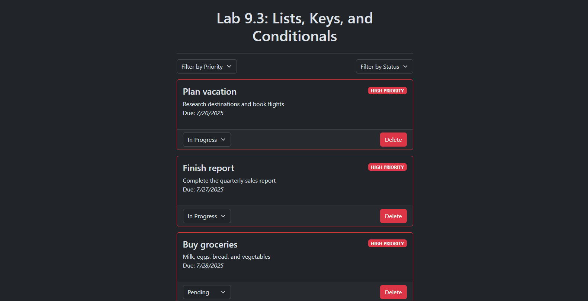

# Lab 9.3: Lists, Keys, and Conditionals

[Karl Johnson](https://github.com/hirekarl)  
2025-RTT-30
<time datetime="2025-07-26">2025-07-26</time>  



## Overview
### Viewer Instructions
1. Run the following in the terminal:

```bash
cd task-manager && npm i && npm run dev
```

2. Navigate in the terminal to http://localhost:5173.

### Submission Source
Top-level application behavior can be found in [`./task-manager/src/App.tsx`](./task-manager/src/App.tsx).

### Reflection
#### 1. How did you ensure unique keys for your list items?
> When invoking the `TaskItem`s in `TaskList`, each `task.id` is mapped to the `key` property on each corresponding `TaskItem`. I made mock data and set IDs to be UUIDs.

#### 2. What considerations did you make when implementing the filtering functionality?
> I went back and forth about how to handle the visibility of tasks depending on applied filters, and ultimately decided to hold the filters object as a state variable in the root `App`. The filters object gets passed up from the `TaskFilter` child component via `App.handleFilters`, which is passed as the `onFilterChange` property to `TaskFilter`.

#### 3. How did you handle state updates for task status changes?
> I implemented a `handleStatusChange` method on `App` (passed to `TaskList` as its `onStatusChange` property) that calls `setTasks`, which maps the new `status` property (passed to `handleStatusChange` as `newStatus`) onto the previous `Task` object that matches the `taskId` passed to `handleStatusChange`. For all other `Task` objects, they are mapped as themselves to the new array of `Task`s (no change).

#### 4. What challenges did you face when implementing conditional rendering?
> My first, naive implementation was to hold an array of `TaskID`s as a state variable, `visibleTaskIDs`, which got updated with the IDs of `Task`s that are meant to be visible. This implementation didn't take into account that `setVisibleTaskIDs` is asynchronous, and I wouldn't have access to the new `visibleTaskIDs` array when I needed it. Figuring out how to hold the filters object in state and manipulate it properly was the key to solving all my conditional rendering problems.


## Assignment Instructions
### Lab Overview
In this lab, you will create a Task Management application that demonstrates dynamic list rendering, proper key usage, and conditional rendering. You will practice creating TypeScript React components that handle lists of data, implement filtering, and show different states based on task properties. This lab focuses on list rendering, key management, conditional rendering, and component composition using React and TypeScript.

### Workplace Context
Imagine you are a frontend developer working on a task management system. Your team needs a component that can display a list of tasks, filter them by status, and show different visual states based on task properties. The component should be reusable, type-safe, and handle various task states efficiently.

This lab will help you practice building components that work with dynamic data and implement proper React patterns for list rendering.

### Activity Tasks
#### 1.Component Implementation
- [x] Implement each component according to its interface requirements.
- [x] Use proper TypeScript types and interfaces.
- [x] Implement list rendering with unique keys.
- [x] Add conditional rendering based on task properties.

#### 2.List Management
- [x] Render the task list with proper key props.
- [x] Implement filtering functionality.
- [x] Handle task status changes.
- [x] Implement task deletion.

#### 3. Visual Feedback
- [x] Show different styles based on task status and priority.
- [x] Implement hover and active states.
- [x] Add visual indicators for task properties.

#### 4.Component Composition
- [x] Compose components to create a complete task management interface.
- [x] Handle prop passing between components.
- [x] Implement proper event handling.
